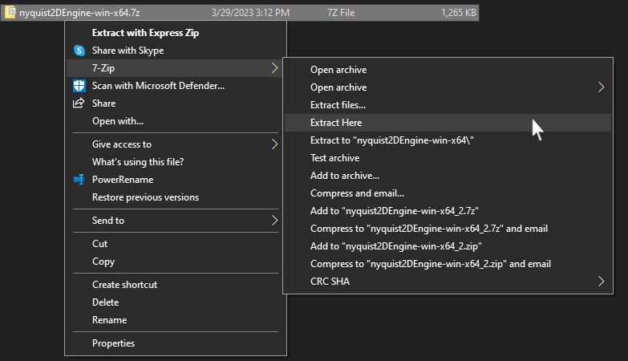
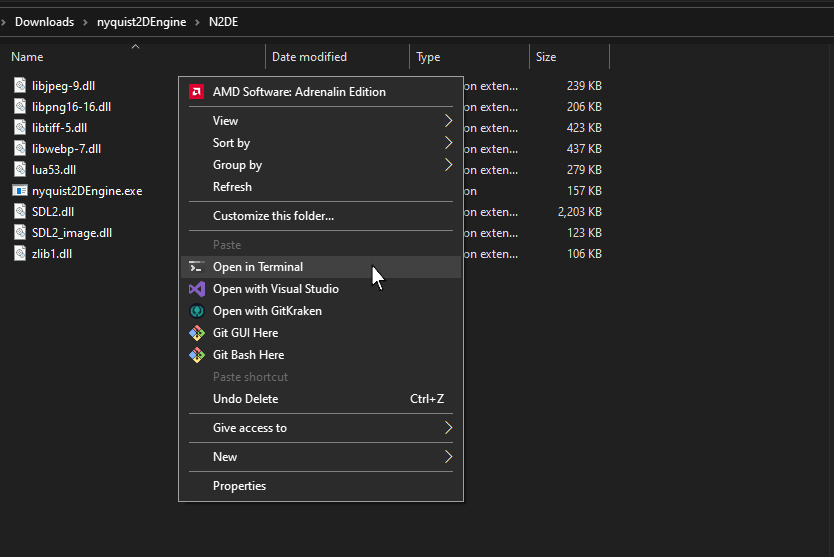
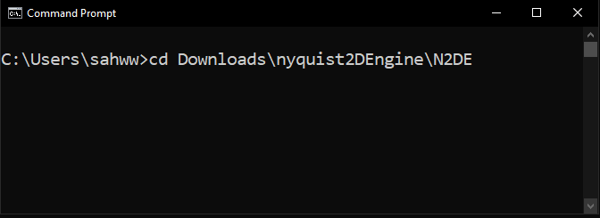
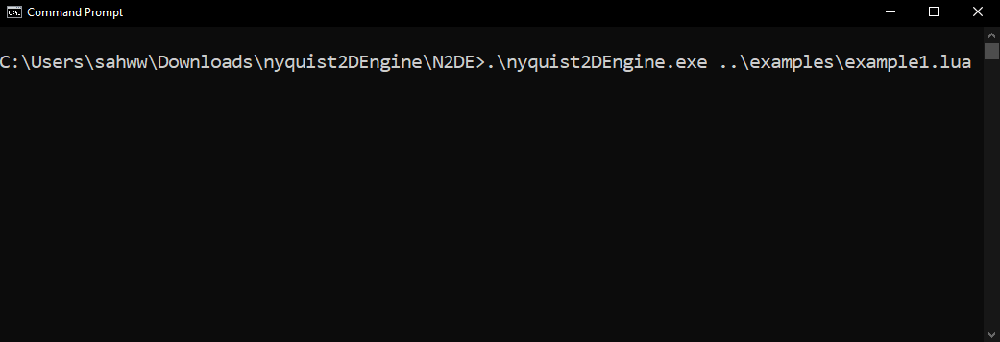
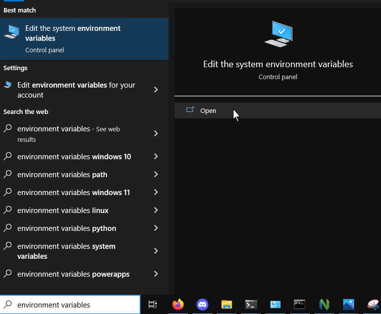
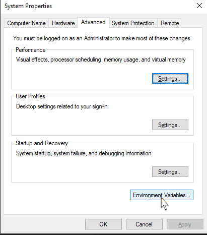
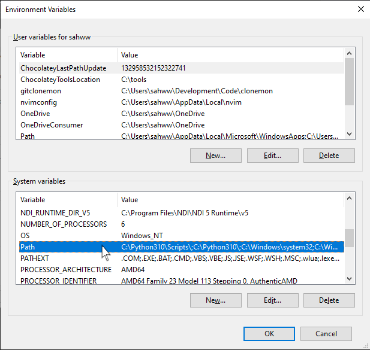
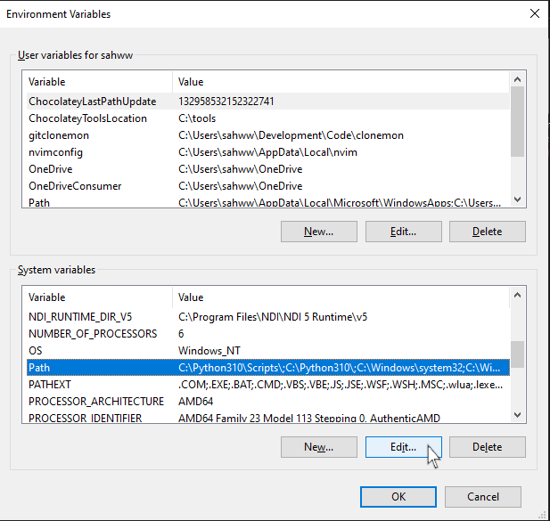
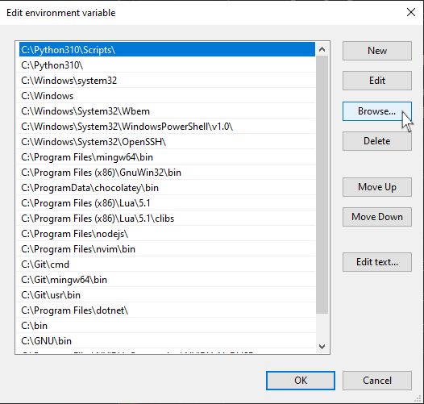
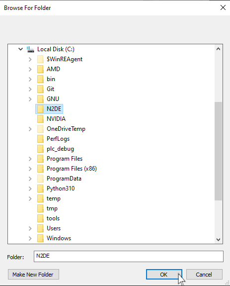

= NYQUIST 2D ENGINE
:docinfo: shared
:source-highlighter: pygments
:pygments-style: monokai
:icons: font
:stem:
:toc: left

[.logo]

== About
The Nyquist 2D Engine (N2DE) is a game engine written in C. It is Cross-Platform
and works in both windows and linux. You create your games in lua using the
https://nyquist2dengine.com/api-index.html[api]. You can checkout the git
repository at
https://importantmsg.xyz/git/?p=nyquist2DEngine.git/.git;a=summary[nyquist2DEngine.git].

== Readme Conventions
<>:: anything surrounded with "<>" can be replaced with anything you choose.

== Installing

NOTE: you will need to install https://www.microsoft.com/en-us/download/details.aspx?id=30679[Visual C++ Redistributable for Visual Studio 2012 Update 4]
for windows

. Download

[%header, cols="1,1"]
|===
| System      | Download
| Windows x64 | [.download]#https://nyquist2dengine.com/downloads/nyquist2DEngine-win-x64.7z#
| Linux x64   | https://nyquist2dengine.com/downloads/nyquist2DEngine-win-x64.7z[linux]
|===

[start=2]
. Extract with 7zip.

.windows

[start=3]
. Once extracted open the N2DE directory in a command prompt or terminal.

.windows

.windows

[start=4]
. Now you can run the engine with a lua file.

.linux
[source, cmd]
----
./nyquist2DEngine <somefile>.lua
----

.windows
[source, cmd]
----
.\nyquist2DEngine.exe <somefile>.lua
----

You can use the example lua file to see if your install worked.

.linux
[source, cmd]
----
./nyquist2DEngine ../examples/example1.lua
----

.windows
[source, cmd]
----
.\nyquist2DEngine.exe ..\examples\example1.lua
----

.windows

== Running from any directory
Once you've install nyquist2DEngine you can run the program from any direcory by following
these steps.

=== Windows

NOTE: nyquist2DEngine creates a ".res" folder in the directory it is ran in for
game resources. If the N2DE folder has this directory you can feel free to
delete it if you are going to be running the program from any directory because
it will now look for the ".res" folder in the local directory you run the program
from.

. Copy the N2DE to any location you'd like.

. Search "environment variables' in the windows search bar. This should populate
  an option that says "Edit the system environment variables". Open that.

[start=3]
. Click on "Envirnment Vriables...".

[start=4]
. Click on Path under "System variables".

[start=5]
. Hit Edit.

[start=6]
. Click "Browse".

[start=7]
. Find the location you copied the N2DE directory to.

[start=8]
. Hit "OK" several time until you're out of all of the opened windows, lol.

That's it! you're done. You can go to any directory you want and use the
nyquist2DEngine to run a lua script from there. Just make sure your lua script
is in the same directory.

== Building from source

WARNING: In order to build in windows you must have visual studio installed.
         This will also install the microsoft compiler that is needed.

. Install the latest snapshot from https://importantmsg.xyz/git/?p=nyquist2DEngine.git/.git;a=summary[nyquist2DEngine.git].
. Use the command bellow in a developer command prompt to build.

=== Linux

[source, cmd]
----
make
----

=== Windows

[source, cmd]
----
nmake.exe -f Makefile.win
----

=== Building Arguments

==== `OUT`

===== Linux

[source, cmd]
----
make OUT="<EXE_NAME>"
----

===== Windows

[source, cmd]
----
nmake.exe -f OUT="<EXE_NAME>" Makefile.win
----

== Running

=== Linux

[source, cmd]
----
./nyquist2DEngine <somefile>.lua
----

=== Windows

[source, cmd]
----
.\nyquist2DEngine.exe <somefile>.lua
----

== Cleaning Build

=== Linux

[source, cmd]
----
make clean
----

=== Windows

[source, cmd]
----
nmake.exe -f Makefile.win clean
----

== Libraries Used

*Serious love for SDL2 and lua!*

* https://www.libsdl.org/[SDL2]
* https://libsdl.org/projects/old/SDL_image/[SDL2_image]
* https://www.libsdl.org/projects/old/SDL_ttf/[SDL2_ttf]
* https://www.sqlite.org/index.html[sqlite]
* https://www.lua.org/[lua] (obviously)

== Todo

* [x] *Game creation with lua*

* [ ] *Game terminal (luaL_loadstring)*

* [ ] *Modular ui*

* [x] *Implement SDL_image*
** [ ] Transparency
** [ ] Rotation?

* [ ] *Hit Boxes*

* [ ] *Easy way to set frequency of while loops*

* [x] *Textboxes*
** [ ] Name of person speaking
** [x] Changable font color
** [x] Changable Background color
** [x] Use ttf font file

* [ ] *Map Editor*

* [ ] *Normalization for world.h (database)*

